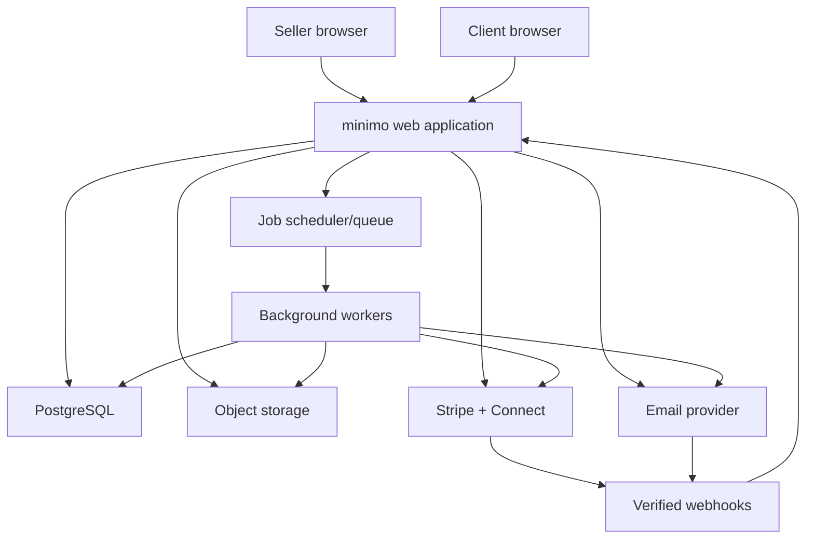

# minimo — Technical Architecture

> Version 1.0 · Implementation blueprint  
> Read with [`PRD.md`](./PRD.md) and [`DESIGN.md`](./DESIGN.md)

## 1. Architecture goals

minimo should begin as a **modular monolith**: one deployable web application, one primary relational database, and independently executed background workers. This keeps the system understandable while preserving boundaries that can later be extracted.

The architecture must prioritize:

- Correct money calculations and immutable sent invoices
- Strict workspace isolation
- Reliable email, reminder, PDF, and webhook processing
- Stripe-hosted handling of sensitive payment details
- Minimal collection of personal data
- Fast mobile web performance
- Easy local development and deployment
- Clear seams for replacing vendors

## 2. Recommended stack

This is the default build path, not an irreversible mandate.

| Layer | Recommendation | Reason |
|---|---|---|
| Framework | Next.js 15+ App Router, TypeScript | Full-stack React, server rendering, route handlers, mature ecosystem |
| UI | React, Tailwind CSS, shadcn/ui primitives | Accessible foundations with full visual control |
| Forms | React Hook Form + Zod | Performant forms and shared validation schemas |
| Database | PostgreSQL | Transactions, constraints, JSON support, reliable relational model |
| ORM | Drizzle ORM | Typed SQL and explicit migrations; Prisma is acceptable if preferred |
| Authentication | Clerk, Better Auth, or Auth.js | Avoid building credential security from scratch |
| Payments | Stripe Billing + Stripe Connect | minimo subscriptions plus seller payment acceptance |
| Email | Resend or Postmark | Transactional delivery events and templates |
| Jobs | Inngest, Trigger.dev, or a Postgres-backed queue | Retries, scheduled reminders, observability |
| Files | S3-compatible object storage | Logos, generated PDFs, export archives |
| PDF | React PDF or server-side HTML-to-PDF | One invoice presentation model with stable output |
| Analytics | PostHog with privacy-safe event properties | Funnel and feature analytics |
| Errors | Sentry | Exceptions and performance monitoring |
| Hosting | Vercel for web + managed Postgres in US region | Simple deployment; workers chosen to fit queue provider |
| Tests | Vitest, Testing Library, Playwright | Unit, component, integration, and end-to-end coverage |

Do not add Redis, microservices, Kubernetes, GraphQL, or event streaming until measured requirements justify them.

## 3. System context



## 4. Repository layout

```text
minimo/
├── app/
│   ├── (marketing)/
│   ├── (auth)/
│   ├── (app)/
│   │   ├── home/
│   │   ├── invoices/
│   │   ├── clients/
│   │   ├── payments/
│   │   └── settings/
│   ├── i/[publicToken]/
│   ├── api/
│   │   ├── webhooks/stripe/
│   │   ├── webhooks/email/
│   │   └── internal/jobs/
│   └── layout.tsx
├── components/
│   ├── ui/
│   ├── invoice/
│   ├── client/
│   └── shared/
├── features/
│   ├── accounts/
│   ├── workspaces/
│   ├── clients/
│   ├── invoices/
│   ├── payments/
│   ├── delivery/
│   ├── reminders/
│   └── exports/
├── server/
│   ├── auth/
│   ├── db/
│   │   ├── schema/
│   │   ├── migrations/
│   │   └── repositories/
│   ├── services/
│   ├── jobs/
│   ├── integrations/
│   ├── observability/
│   └── security/
├── emails/
├── pdf/
├── lib/
├── tests/
│   ├── unit/
│   ├── integration/
│   └── e2e/
├── public/
├── docs/
│   ├── PRD.md
│   ├── ARCHITECTURE.md
│   └── DESIGN.md
└── .env.example
```

Rules:

- Routes call application services, not the database directly.
- Services implement use cases and transactions.
- Repositories enforce workspace scoping.
- Integrations wrap vendor SDKs.
- Shared UI components contain no business persistence logic.
- Never import server secrets into client components.

## 5. Application modules

### Identity and access

Owns authentication mapping, sessions, email verification, membership, and permissions.

### Workspace

Owns seller/business profile, defaults, timezone, numbering sequence, brand settings, subscription, and Stripe connected-account references.

### Clients

Owns reusable client records. Sent invoices copy client information into snapshots.

### Invoices

Owns drafts, items, calculations, snapshots, PDFs, statuses, public links, corrections, and voiding.

### Delivery

Owns email messages, provider event ingestion, suppression, retries, and delivery timeline.

### Reminders

Owns schedules, eligibility rules, idempotency, and queued sends.

### Payments

Owns connected-account state, payment session creation, webhook reconciliation, manual payments, and refunds when added.

### Audit and events

Owns append-only business events and privileged action records.

### Export and deletion

Owns user export jobs, account closure, retention enforcement, and deletion/anonymization workflows.

## 6. Data model

Use UUIDv7/ULID-style opaque primary keys. Every tenant-owned table includes `workspace_id`, indexed and enforced in every query path. Public resources use separate high-entropy tokens.

### Core entities

#### users

```text
id
auth_provider_user_id UNIQUE
email_normalized
display_name NULL
email_verified_at NULL
created_at
updated_at
disabled_at NULL
```

Do not store raw passwords when using an authentication provider.

#### workspaces

```text
id
name
slug UNIQUE
country_code
currency_code DEFAULT 'USD'
timezone
invoice_prefix NULL
next_invoice_sequence
logo_object_key NULL
support_email NULL
stripe_customer_id NULL          # minimo subscription
stripe_connected_account_id NULL # seller payment account
stripe_connect_status
created_at
updated_at
closed_at NULL
```

#### workspace_members

```text
workspace_id
user_id
role  # owner | admin | member
created_at
PRIMARY KEY (workspace_id, user_id)
```

#### clients

```text
id
workspace_id
display_name
company_name NULL
email
email_normalized
phone NULL
address_json NULL
notes NULL
created_at
updated_at
archived_at NULL
```

#### invoices

Represents the mutable workflow record and pointers to immutable versions.

```text
id
workspace_id
client_id NULL
invoice_number
status
currency_code
issue_date
due_date
subtotal_minor
discount_minor
tax_minor
total_minor
amount_paid_minor
amount_due_minor
current_version_id NULL
public_token_hash
sent_at NULL
first_viewed_at NULL
paid_at NULL
voided_at NULL
void_reason NULL
replaces_invoice_id NULL
created_by_user_id
created_at
updated_at
UNIQUE (workspace_id, invoice_number)
```

#### invoice_versions

Immutable after creation.

```text
id
invoice_id
workspace_id
version_number
snapshot_json
snapshot_hash
pdf_object_key NULL
created_by_user_id
created_at
UNIQUE (invoice_id, version_number)
```

The snapshot contains seller identity, client identity, dates, currency, items, notes, totals, payment settings, and template version. It must contain everything required to render the historical invoice without joining mutable profile records.

#### invoice_draft_items

```text
id
invoice_id
workspace_id
position
description
quantity_decimal
unit_price_minor
line_total_minor
created_at
updated_at
```

Draft items may change. A sent version copies normalized items into `snapshot_json`.

#### invoice_events

Append-only business timeline.

```text
id
workspace_id
invoice_id
event_type
actor_type       # user | client | system | provider | support
actor_id NULL
source_event_id NULL
safe_metadata_json
occurred_at
created_at
UNIQUE NULLS NOT DISTINCT (event_type, source_event_id)
```

#### email_messages

```text
id
workspace_id
invoice_id NULL
message_type
recipient_email_normalized
provider_message_id NULL
status
idempotency_key UNIQUE
attempt_count
last_error_code NULL
scheduled_for NULL
sent_at NULL
created_at
updated_at
```

#### reminder_rules

```text
id
workspace_id
invoice_id NULL       # null means default workspace rule
timing_type           # before_due | on_due | after_due
offset_days
enabled
template_subject
template_body
created_at
updated_at
```

#### payments

```text
id
workspace_id
invoice_id
source_type           # stripe | manual
provider_payment_id NULL
provider_session_id NULL
status
amount_minor
currency_code
method_display NULL
recorded_by_user_id NULL
note NULL
paid_at NULL
created_at
updated_at
UNIQUE (workspace_id, provider_payment_id)
```

#### webhook_events

```text
id
provider
provider_event_id
event_type
payload_object_key_or_redacted_json
status               # received | processing | processed | failed | ignored
attempt_count
last_error NULL
received_at
processed_at NULL
UNIQUE (provider, provider_event_id)
```

#### audit_logs

```text
id
workspace_id NULL
actor_type
actor_id NULL
action
target_type
target_id NULL
request_id
ip_hash NULL
metadata_json
created_at
```

Avoid placing invoice descriptions, notes, full webhook payloads, access tokens, or secrets in audit metadata.

## 7. Money and invoice correctness

- Store money as integer minor units with ISO currency.
- Use a decimal library for quantity math; never JavaScript floating-point arithmetic for final totals.
- Implement one pure calculation function shared by server services and tests.
- Recalculate from trusted item inputs server-side on every write.
- Store calculation policy/version in the invoice snapshot.
- Add database checks: amounts non-negative where required, valid currency length, due date not before issue date.
- Create invoice number and sent version in one transaction.
- Lock the workspace sequence row (`SELECT ... FOR UPDATE`) or use an atomic database sequence strategy.
- Hash serialized snapshots using stable canonical serialization.

## 8. Authorization and tenant isolation

Every authenticated request follows:

1. Validate session.
2. Resolve active workspace membership.
3. Check action-level permission.
4. Query using both resource ID and `workspace_id`.
5. Return generic not-found for cross-tenant resources.

Never perform `findById(id)` and then rely only on UI checks.

Recommended repository signature:

```ts
getInvoice(params: { workspaceId: string; invoiceId: string }): Promise<Invoice | null>
```

Add integration tests that attempt cross-workspace reads, writes, exports, public-link guessing, and ID substitution.

## 9. Public invoice security

- Generate at least 128 bits of cryptographically secure entropy.
- Store only a hash of the public token where practical.
- Compare token hashes safely.
- Apply IP and token-based rate limits.
- Do not expose seller admin links, internal IDs, or client records.
- Set `Referrer-Policy: strict-origin-when-cross-origin` or stricter.
- Prevent indexing with `noindex, nofollow` and suitable headers.
- Use cache rules that prevent shared caching of personalized/sensitive pages.
- Allow token rotation, with old-token invalidation, when required.
- Record a view without collecting invasive fingerprinting data.

## 10. Invoice send transaction

The user-visible send request should be safe to retry.

```text
1. Validate authenticated workspace and draft ownership.
2. Validate recipient and invoice fields.
3. Recalculate totals.
4. Begin database transaction.
5. Lock/reserve invoice number if not already reserved.
6. Create immutable invoice version and snapshot hash.
7. Change invoice status to queued.
8. Create outbox/email job using a unique idempotency key.
9. Append invoice event.
10. Commit.
11. Worker generates PDF if needed and sends email.
12. Provider events update delivery status and timeline.
```

Do not send external email inside the database transaction. Use a transactional outbox or job created within the same transaction.

## 11. Background jobs

### Required jobs

- Generate invoice PDF
- Send invoice email
- Send manual/automatic reminder
- Evaluate reminder eligibility
- Process Stripe webhook
- Process email-provider webhook
- Reconcile uncertain payment states
- Build account export
- Apply retention/deletion actions
- Clean expired sessions/tokens and orphan files

### Job contract

Every job has:

- Stable job type and version
- Idempotency key
- Minimal payload containing entity IDs, not full PII
- Maximum attempts
- Exponential backoff with jitter
- Retryable versus terminal error classification
- Structured logging with request/job ID
- Dead-letter or failed-job visibility
- Safe manual replay procedure

## 12. Stripe architecture

### Separate concerns

1. **minimo billing:** minimo's Stripe account charges users for minimo plans.
2. **Seller payments:** Stripe Connect enables each seller to receive client invoice payments.

These must use separate service modules and identifiers.

### Recommended integration

- Use Stripe-hosted Connect onboarding.
- Use Stripe-hosted Checkout or Payment Links/session flow rather than collecting payment details in minimo forms.
- Choose Standard/Express account and direct/destination charge model only after legal, UX, fee, and support review.
- Store account/payment/session/customer IDs and safe status fields only.
- Never store PAN, CVV, bank login, raw account numbers, identity documents, or Stripe secret values in the database.

### Payment session creation

- Authenticate public invoice token.
- Confirm invoice is open and amount due is positive.
- Confirm connected account is eligible.
- Create/reuse a payment session using `invoice_id + amount_due + version` as an idempotency basis.
- Attach internal opaque identifiers in allowed metadata.
- Use an allowlisted return URL.
- Do not change invoice state on return-page query parameters.

### Webhook ingestion

```text
receive raw body
→ verify Stripe signature
→ insert provider event ID uniquely
→ acknowledge quickly
→ enqueue processing
→ resolve connected account and invoice
→ apply transition transactionally
→ append invoice/payment event
→ trigger receipt/notifications
```

- Reject invalid signatures.
- Handle out-of-order events.
- Treat duplicates as successful no-ops.
- Periodically reconcile payments stuck in pending/processing.
- Log safe IDs, never full sensitive payloads.

## 13. Email and deliverability

- Authenticate sending domain with SPF, DKIM, and DMARC.
- Use a dedicated transactional subdomain.
- Separate marketing and transactional streams.
- Ingest delivery, bounce, complaint, and suppression events.
- Do not retry hard bounces.
- Automatically suppress complained recipients.
- Limit new-workspace send volume and increase limits with healthy history.
- Use neutral subjects; avoid misleading urgency.
- Include seller identity, invoice number, amount, due date, secure CTA, and support information.
- Never include full sensitive invoice descriptions in subject lines.

## 14. PDF strategy

Use a normalized invoice view model consumed by both hosted-page and PDF renderers.

```ts
type InvoiceDocument = {
  templateVersion: number;
  seller: SellerSnapshot;
  client: ClientSnapshot;
  invoiceNumber: string;
  issueDate: string;
  dueDate: string;
  currency: string;
  items: InvoiceItemSnapshot[];
  subtotalMinor: number;
  discountMinor: number;
  taxMinor: number;
  totalMinor: number;
  amountPaidMinor: number;
  amountDueMinor: number;
  notes?: string;
};
```

Requirements:

- Deterministic rendering from immutable snapshot
- Font assets bundled/versioned
- Visual regression tests for long names, many items, wrapping, zero tax, large totals, and multi-page output
- PDF generated before email attachment or email links to hosted download
- Object key not guessable; access via authorized or short-lived signed URL

## 15. API conventions

Use server actions for tightly coupled authenticated form mutations if the team is comfortable with them; use route handlers for webhooks, public APIs, and integration callbacks.

### Response shape

```ts
type ApiResult<T> =
  | { ok: true; data: T; requestId: string }
  | {
      ok: false;
      error: {
        code: string;
        message: string;
        fieldErrors?: Record<string, string[]>;
      };
      requestId: string;
    };
```

Error messages shown to users are plain language. Internal errors stay in monitoring with the same request ID.

### Endpoint boundaries

```text
POST   /api/invoices                 create draft
PATCH  /api/invoices/:id             update draft
POST   /api/invoices/:id/send        queue send
POST   /api/invoices/:id/remind      manual reminder
POST   /api/invoices/:id/void        void invoice
POST   /api/invoices/:id/correct     create correction draft
POST   /api/invoices/:id/manual-pay  record manual payment
GET    /api/invoices/:id/pdf         authorized PDF access
POST   /api/connect/start             begin Stripe onboarding
POST   /api/public/invoices/:token/pay create payment session
POST   /api/webhooks/stripe           raw verified webhook
POST   /api/webhooks/email            verified provider webhook
POST   /api/data/export               request export
POST   /api/account/delete            request closure/deletion
```

These are conceptual contracts; framework implementation may use server actions without changing service boundaries.

## 16. Validation and security controls

- Zod schemas at all trust boundaries
- Parameterized ORM/SQL queries
- Output encoding and React's safe defaults; sanitized rich text if ever introduced
- CSRF protection for cookie-authenticated mutations
- `HttpOnly`, `Secure`, `SameSite` cookies
- Content Security Policy
- HSTS and secure headers
- Origin validation for sensitive callbacks where applicable
- File type, size, signature, and image-dimension validation for logos
- Virus scanning for future arbitrary attachments; arbitrary attachments are out of MVP
- Rate limits for login, signup, sending, reminders, public views, and payment-session creation
- Secret storage in platform secret manager, never committed `.env`
- Separate development, preview, staging, and production secrets/databases
- Dependency updates and automated vulnerability scanning

## 17. Data minimization and retention

Store:

- Account identity and security metadata
- Seller business profile
- Client contact data needed to deliver invoices
- Invoice snapshots and generated document references
- Stripe/email provider IDs and safe statuses
- Minimal audit, delivery, and analytics events

Do not store:

- Raw card numbers, CVV, bank credentials, or identity documents
- Stripe secret keys in database rows
- User passwords when delegated to auth provider
- Full client data in analytics or ordinary logs
- Full webhook payloads indefinitely without a documented need
- Email tracking fingerprints

Retention durations must be documented and configurable by category. Account deletion may anonymize or restrict access before legally required financial/audit records can be destroyed. Legal counsel must approve final periods.

## 18. Observability

### Logs

Structured JSON with:

- timestamp
- environment
- level
- request/job ID
- safe user/workspace/entity IDs
- action/event name
- latency
- error code/class

Redact authorization headers, cookies, tokens, email bodies, invoice notes, client addresses, and payment details.

### Metrics

- Request rate, latency, and error rate
- Database connections/query latency
- Job queue depth, age, retries, failures
- Invoice send success/failure
- Email bounce/complaint rate
- Webhook delay/failure
- Payment pending duration and reconciliation mismatches
- PDF generation latency/failure

### Alerts

- Sustained API error rate
- Queue age beyond threshold
- Webhook signature failures spike
- Payment processing/reconciliation failures
- Email complaint/bounce spike
- Database/storage capacity risk
- Backup or scheduled job failure

## 19. Backup and disaster recovery

- Managed database point-in-time recovery
- Encrypted object storage with versioning where appropriate
- Document target RPO/RTO before beta
- Quarterly restoration drill at minimum
- Restore into isolated environment and verify a complete sample: workspace, client, invoice snapshot, PDF, payment state, and event timeline
- Monitor backup jobs; a configured but untested backup is not considered operational

## 20. Testing strategy

### Unit tests

- Money calculations and rounding
- Invoice-state transition rules
- Reminder eligibility
- Permission checks
- Email template view models
- Token hashing/validation helpers

### Integration tests

- Database constraints and transaction rollback
- Workspace isolation
- Send outbox/idempotency
- Stripe webhook signature, duplicate, and out-of-order handling
- Email provider events
- Invoice number concurrency
- Export/deletion workflow

### End-to-end tests

- Signup to first send
- Returning user creates invoice
- Public client view on mobile
- Stripe test payment success, failure, cancellation, and delayed event
- Reminder scheduling and suppression
- Correction and void flows
- Manual payment
- Keyboard navigation

### Required adversarial tests

- Swap workspace/invoice IDs
- Guess/abuse public tokens
- Replay send, reminder, and webhook requests
- Submit client-calculated false totals
- Inject markup/script into every text field
- Exceed field, file, and request limits

## 21. CI/CD and environments

### Environments

- Local: developer database and vendor test modes
- Preview: per-branch deployment with isolated/non-production data
- Staging: production-like, Stripe/email test modes, stable URL
- Production: live keys and restricted access

### Pipeline

```text
format/lint
→ type-check
→ unit tests
→ integration tests
→ build
→ migration safety check
→ deploy preview/staging
→ Playwright smoke tests
→ approved production deploy
→ post-deploy health check
```

- Migrations are forward-safe and reviewed.
- Never automatically run destructive production migrations.
- Use feature flags for payment/reminder rollout.
- Provide a rollback path for application code.

## 22. Environment variables

`.env.example` contains names only:

```dotenv
APP_URL=
DATABASE_URL=
AUTH_SECRET=
AUTH_PROVIDER_KEY=
STRIPE_SECRET_KEY=
STRIPE_WEBHOOK_SECRET=
STRIPE_CONNECT_CLIENT_ID=
EMAIL_PROVIDER_API_KEY=
EMAIL_WEBHOOK_SECRET=
EMAIL_FROM=
OBJECT_STORAGE_ENDPOINT=
OBJECT_STORAGE_BUCKET=
OBJECT_STORAGE_ACCESS_KEY=
OBJECT_STORAGE_SECRET_KEY=
SENTRY_DSN=
POSTHOG_KEY=
POSTHOG_HOST=
JOB_PROVIDER_SECRET=
```

Never expose server-only variables with a public/client prefix.

## 23. Build order

1. Repository, CI, environments, auth, database, observability
2. Workspace profile and settings
3. Client CRUD
4. Invoice draft editor and authoritative calculation engine
5. Immutable snapshots and PDF generation
6. Public invoice page and secure tokens
7. Email sending, outbox, delivery webhooks, timeline
8. Stripe Connect onboarding and hosted checkout
9. Stripe webhook processing and reconciliation
10. Reminder scheduler and suppression rules
11. Dashboard/search
12. Export/deletion and admin support tools
13. Billing, plan limits, and launch hardening

## 24. Architecture decision records to create

- ADR-001: Modular monolith
- ADR-002: Authentication provider
- ADR-003: ORM and migration tooling
- ADR-004: Stripe Connect account and charge model
- ADR-005: Invoice calculation/rounding policy
- ADR-006: PDF rendering technology
- ADR-007: Queue/scheduler provider
- ADR-008: Public token storage and rotation
- ADR-009: Retention and deletion enforcement
- ADR-010: Hosting region and vendor selection

## 25. Vibe-coding guardrails

Use these instructions in every coding-agent prompt:

1. Read all three project documents before editing.
2. Implement only the requested vertical slice.
3. Do not invent features or vendors outside the documents.
4. Never bypass workspace-scoped authorization.
5. Never trust totals, statuses, or ownership from the client.
6. Never store payment credentials or secrets.
7. Add loading, empty, validation, failure, retry, and success states.
8. Add tests for business rules and tenant isolation.
9. Run lint, type-check, tests, and production build before declaring completion.
10. Summarize changed files, migrations, environment variables, tests, and remaining risks.

